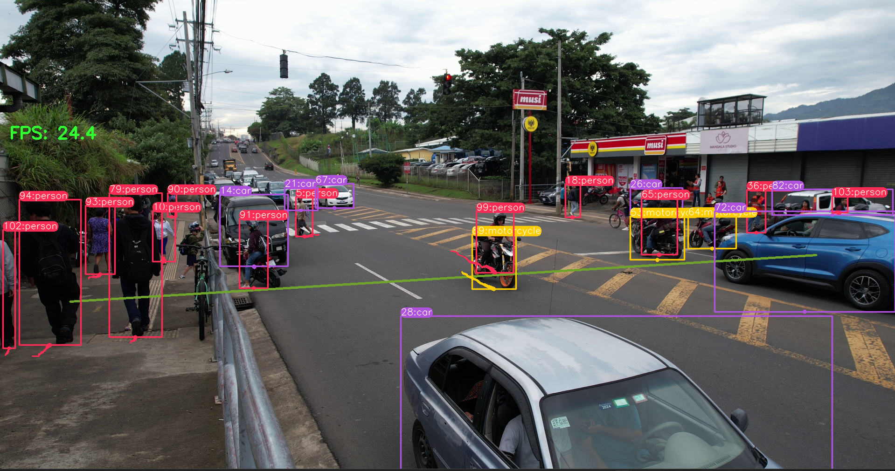

# Scripts principales de detección, seguimiento y análisis

Esta carpeta contiene los **scripts base del proyecto**, utilizados como
puntos de control para asegurar avances progresivos sin corromper versiones
anteriores.

---

## Scripts base del proyecto

### 1. `predict_base.py` — Versión base estable

**Propósito**
- Base del sistema
- Punto de partida para todas las demás versiones

**Características**
- Detección de objetos con YOLOv8
- Seguimiento multiobjeto con DeepSORT
- Visualización de bounding boxes
- Sin conteo
- Sin velocidad
- Sin base de datos

**Estado**
- Estable
- No se modifica directamente
- Referencia principal

---

### 2. `predict_contador.py` — Conteo y optimización

**Propósito**
- Introducir conteo direccional
- Optimizar rendimiento gráfico y computacional

**Características**
- Conteo por cruce de línea
- Clasificación por tipo de objeto
- Reducción de trazos y grosor de líneas
- Mejora de FPS
- Interfaz visual más limpia

**Estado**
- Funcional
- Optimizada
- En constante ajuste

---

### 3. `predict_spend.py` — Estimación de velocidad (experimental)

**Propósito**
- Cálculo de velocidad a partir de video

**Características**
- Cálculo de velocidad usando desplazamiento entre frames
- Velocidades estimadas (no reales)
- Dependencia fuerte de FPS y perspectiva
- Integración con tracking existente

**Estado**
- Experimental
- No confiable para mediciones reales
- Usado solo para análisis

---

### 4. `predict1.py` — Integración completa del sistema

**Propósito**
- Unificar todas las funcionalidades desarrolladas

**Características**
- Detección
- Seguimiento
- Conteo
- Estimación de velocidad
- Conversión píxel → metro mediante homografía
- Inserción de datos en base de datos PostgreSQL

**Estado**
- Alta tasa de prueba y error
- Versión más avanzada

---

## Consideraciones importantes

- La **estimación de velocidad real** depende:
  - Ángulo de la cámara
  - Posición de la línea
  - Calibración de homografía
- Pequeños cambios en el video afectan los resultados
- No existe aún una solución para todos los escenarios hasta el momento
---
## Anexos 
Procesamiento del progrma predict_base.py 

